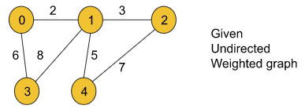
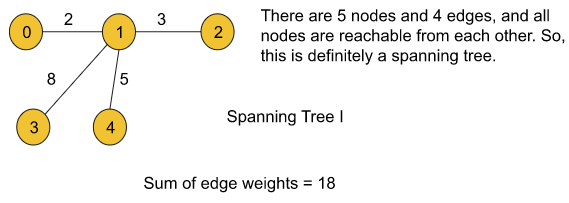

# Spanning Tree:
A spanning tree is a tree in which we have N nodes(i.e. All the nodes present in the original graph) and N-1 edges and all nodes are reachable from each other.

Let’s understand this using an example. Assume we are given an undirected weighted graph with N nodes and M edges. Here in this example, we have taken N as 5 and M as 6.

For the above graph, if we try to draw a spanning tree, the following illustration will be one:

We can draw more spanning trees for the given graph. Two of them are like the following:

> Note: Point to remember is that a graph may have more than one spanning trees.

All the above spanning trees contain some edge weights. For each of them, if we add the edge weights we can get the sum for that particular tree. Now, let’s try to figure out the minimum spanning tree:

# Minimum Spanning Tree:
**Among all possible spanning trees of a graph, the minimum spanning tree is the one for which the sum of all the edge weights is the minimum.**

Let’s understand the definition using the given graph drawn above. Until now, for the given graph we have drawn three spanning trees with the sum of edge weights 18, 24, and 18. If we can draw all possible spanning trees, we will find that the following spanning tree with the minimum sum of edge weights 16 is the **minimum spanning tree** for the given graph:

**Practice Problem:**
Now, in case you have understood the concepts well, you can try to figure out the minimum spanning tree for the following undirected weighted graph:

**Answer:**

Sum of edge weight=17

There are a couple of algorithms that help us to find the minimum spanning tree of a graph. One is **Prim’s algorithm** and the other is **Kruskal’s algorithm**.

# Kruskal’s Minimum Spanning Tree (MST) Algorithm
In Kruskal’s algorithm, we sort all edges of the given graph in increasing order. Then it keeps on adding new edges and nodes in the MST if the newly added edge does not form a cycle. It picks the minimum weighted edge at first and the maximum weighted edge at last. Thus we can say that it makes a locally optimal choice in each step in order to find the optimal solution. Hence this is a Greedy Algorithm.

## How to find MST using Kruskal’s algorithm?
Below are the steps for finding MST using Kruskal’s algorithm:

- Sort all the edges in a non-decreasing order of their weight. 
- Pick the smallest edge. Check if it forms a cycle with the spanning tree formed so far. If the cycle is not formed, include this edge. Else, discard it. 
- Repeat step 2 until there are (V-1) edges in the spanning tree.
Kruskal’s Algorithm uses the **Disjoint Set Data Structure** to detect cycles. 

**Illustration:**

**Time Complexity:** O(E * log E) or O(E * log V) 