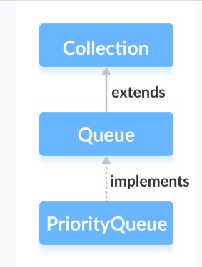
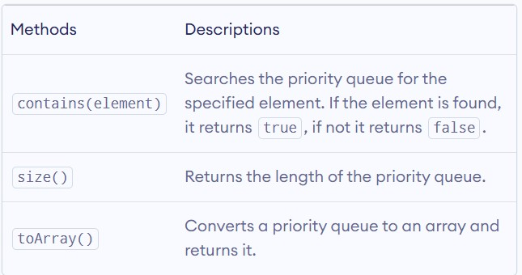

# Java PriorityQueue
The PriorityQueue class provides the functionality of the heap data structure.It implements the Queue interface.




Unlike normal queues, priority queue elements are retrieved in sorted order.

Suppose, we want to retrieve elements in the ascending order. In this case, the head of the priority queue will be the smallest element. Once this element is retrieved, the next smallest element will be the head of the queue.

It is important to note that the elements of a priority queue may not be sorted. However, elements are always retrieved in sorted order.

## Creating PriorityQueue
In order to create a priority queue, we must import the **java.util.PriorityQueue** package. Once we import the package, here is how we can create a priority queue in Java.
```
PriorityQueue<Integer> numbers = new PriorityQueue<>();
```

Here, we have created a priority queue without any arguments. In this case, the head of the priority queue is the smallest element of the queue. And elements are removed in ascending order from the queue.

However, we can customize the ordering of elements with the help of the **Comparator** interface.

## Methods of PriorityQueue
The **PriorityQueue class** provides the implementation of all the methods present in the **Queue interface**.

### Insert Elements to PriorityQueue
- **add()**: Inserts the specified element to the queue. If the queue is full, it throws an exception.
- **offer()** - Inserts the specified element to the queue. If the queue is full, it returns **false**.

## Accessing PriorityQueue Elements
Use peak() method to access the elements of a PriorityQueue.This method returns the head of the Queue.

## Removing PriorityQueue Elements
- **remove()** : removes the specified element from the queue
- **poll()** : returns and removes the head of the queue

## Iterating Over a PriorityQueue
To iterate over the elements of a priority queue, we can use the **iterator()** method. In order to use this method, we must import the **java.util.Iterator package.**

## Other PriorityQueue Methods
