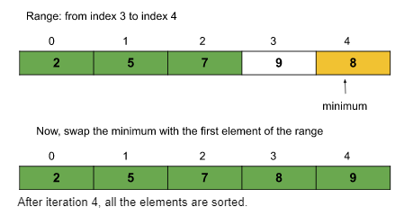

# Selection Sort Algorithm
Approach:
- First, we will select the range of the unsorted array using a loop (say i) that indicates the starting index of the range.
The loop will run forward from 0 to n-1. The value i = 0 means the range is from 0 to n-1, and similarly, i = 1 means the range is from 1 to n-1, and so on.
(Initially, the range will be the whole array starting from the first index.)
- Now, in each iteration, we will select the minimum element from the range of the unsorted array using an inner loop.
- After that, we will swap the minimum element with the first element of the selected range(in step 1). 
- Finally, after each iteration, we will find that the array is sorted up to the first index of the range.

> Note:  Here, after each iteration, the array becomes sorted up to the first index of the range. That is why the starting index of the range increases by 1 after each iteration. This increment is achieved by the outer loop and the starting index is represented by variable i in the following code. And the inner loop(i.e. j) helps to find the minimum element of the range [i…..n-1].

Assume the given array is: {7, 5, 9, 2, 8}

**Outer loop iteration 1:**

The range will be the whole array starting from the 1st index as this is the first iteration. The minimum element of this range is 2(found using the inner loop).

**Outer loop iteration 2:**

The range will be from the [2nd index to the last index] as the array is sorted up to the first index. The minimum element of this range is 5(found using the inner loop).

**Outer loop iteration 3:**

The range will be from the [3rd index to the last index]. The minimum element of this range is 7(found using the inner loop).

**Outer loop iteration 4:**

The range will be from the [4th index to the last index]. The minimum element of this range is 8(found using the inner loop).

So, after 4 iterations(i.e. n-1 iterations where n = size of the array), the given array is sorted.

**Time complexity:** O(N2), (where N = size of the array), for the best, worst, and average cases.

**Reason:** If we carefully observe, we can notice that the outer loop, say i, is running from 0 to n-2 i.e. n-1 times, and for each i, the inner loop j runs from i to n-1. For, i = 0, the inner loop runs n-1 times, for i = 1, the inner loop runs n-2 times, and so on. So, the total steps will be approximately the following: (n-1) + (n-2) + (n-3) + ……..+ 3 + 2 + 1. The summation is approximately the sum of the first n natural numbers i.e. (n*(n+1))/2. The precise time complexity will be O(n2/2 + n/2). Previously, we have learned that we can ignore the lower values as well as the constant coefficients. So, the time complexity is O(n2). Here the value of n is N i.e. the size of the array.

**Space Complexity: O(1)**

# Bubble Sort Algorithm
**Approach:**

The algorithm steps are as follows:

- , we will select the range of the unsorted array. For that, we will run a loop(say i) that will signify the last index of the selected range. The loop will run backward from index n-1 to 0(where n = size of the array). The value i = n-1 means the range is from 0 to n-1, and similarly, i = n-2 means the range is from 0 to n-2, and so on.
- Within the loop, we will run another loop(say j, runs from 0 to i-1 though the range is from 0 to i) to push the maximum element to the last index of the selected range, by repeatedly swapping adjacent elements.
Basically, we will swap adjacent elements(if arr[j] > arr[j+1]) until the maximum element of the range reaches the end.
- Thus, after each iteration, the last part of the array will become sorted. Like: after the first iteration, the array up to the last index will be sorted, and after the second iteration, the array up to the second last index will be sorted, and so on.
- After (n-1) iteration, the whole array will be sorted.

> **Note:** Here, after each iteration, the array becomes sorted up to the last index of the range. That is why the last index of the range decreases by 1 after each iteration. This decrement is achieved by the outer loop and the last index is represented by variable i in the following code. And the inner loop(i.e. j) helps to push the maximum element of range [0….i] to the last index(i.e. index i).

Let requiered array be:int arr[]={13,46,24,52,20,9};

**Iteration 1**:

**Iteration 2:**

**Iteration 3:**

**Iteration 4:**

**Iteration 5:**

**Time Complexity:** O(N2) for the worst and average cases and O(N) for the best case. Here, N = size of the array.

**Space Complexity:** O(1)

# Insertion Sort Algorithm
**Approach:** 

- Select an element in each iteration from the unsorted array(using a loop).
- Place it in its corresponding position in the sorted part and shift the remaining elements accordingly (using an inner loop and swapping).
- The “inner while loop” basically shifts the elements using swapping.

**Dry Run:**
- The purple color represents the unsorted array.
- The yellow color represents the current element that needs to be placed in the appropriate position.
- The green color represents the sorted array.

**Let the array be:** int arr[]={13,46,24,52,20,9};

## Outer loop iteration 1(selected index i = 0):

 The element at index i=0 is 13 and there is no other element on the left of 13. So, currently, the subarray up to the first index is sorted as it contains only element 13.

## Outer loop iteration 2(selected index i = 1):

The selected element at index i=1 is 46. Now, we will try to move leftwards and put 46 in its correct position. Here, 46 > 13 and so 46 is already in its correct position. Now, the subarray up to the second index is sorted.

## Outer loop iteration 3(selected index i = 2):

The selected element at index i=2 is 24. Now, we will try to move leftwards and put 24 in its correct position. Here, the correct position for 24 will be index 1. So, we will insert 24 in between 13 and 46. We will do it by swapping 24 and 46. Now, the subarray up to the third index is sorted.

## Outer loop iteration 4(selected index i = 3):

The selected element at index i=3 is 52. Now, we will try to move leftwards and put 52 in its correct position. Here, the correct position for 52 will be index 3. So, we need not swap anything. Now, the subarray up to the fourth index is sorted.

## Outer loop iteration 5(selected index i = 4):

The selected element at index i=4 is 20. Now, we will try to move leftwards and put 20 in its correct position. Here, the correct position for 20 will be index 1. So, we need to swap adjacent elements until 20 reaches index 1. Now, the subarray up to the fifth index is sorted.

## Outer loop iteration 6(selected index i = 5):

The selected element at index i=5 is 9. Now, we will try to move leftwards and put 9 in its correct position. Here, the correct position for 9 will be index 0. So, we need to swap adjacent elements until 9 reaches index 0. Now, the whole array is sorted.

**Time complexity:** O(N2), (where N = size of the array), for the worst, and average cases.

**Reason:** If we carefully observe, we can notice that the outer loop, say i, is running from 0 to n-1 i.e. n times, and for each i, the inner loop j runs from i to 1 i.e. i times. For, i = 1, the inner loop runs 1 time, for i = 2, the inner loop runs 2 times, and so on. So, the total steps will be approximately the following: 1 + 2 + 3 +......+ (n-2) + (n-1). The summation is approximately the sum of the first n natural numbers i.e. (n*(n+1))/2. The precise time complexity will be O(n2/2 + n/2). Previously, we have learned that we can ignore the lower values as well as the constant coefficients. So, the time complexity is O(n2). Here the value of n is N i.e. the size of the array.

**Space Complexity: O(1)**