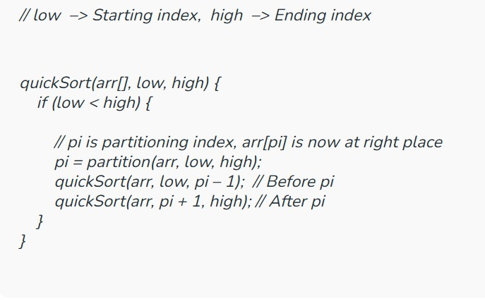
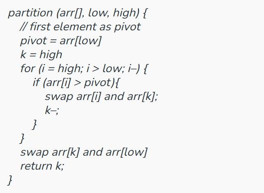
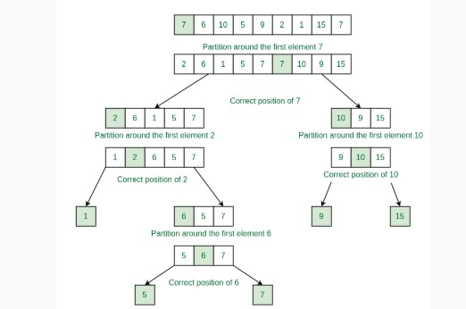

# Merge Sort
**Intuition:**
- Merge Sort is a divide and conquers algorithm, it divides the given array into equal parts and then merges the 2 sorted parts. 
- There are 2 main functions :
   - **merge():** This function is used to merge the 2 halves of the array. It assumes that both parts of the array are sorted and merges both of them.
   - **mergeSort():** This function divides the array into 2 parts. low to mid and mid+1 to high where,
```
 low = leftmost index of the array
 high = rightmost index of the array
 mid = Middle index of the array 
 ```

- We recursively split the array, and go from top-down until all sub-arrays size becomes 1.

**Time complexity:** O(nlogn) 

Reason: At each step, we divide the whole array, for that logn and we assume n steps are taken to get a sorted array, so overall time complexity will be nlogn

**Space complexity:** O(n)  
Reason: We are using a temporary array to store elements in sorted order.

**Auxiliary Space Complexity:** O(n)

# QuickSort 
is a Divide and Conquer algorithm. It picks an element as a pivot and partitions the given array around the pivot. There are many different versions of quickSort that pick the pivot in different ways. 

- Always pick the first element as a pivot.
- Always pick the last element as a pivot.
- Pick a random element as a pivot.
- Pick the median as the pivot.

> Here we will be implementing quick sort by picking the first element as the pivot.

## Quick Sort by picking the first element as the Pivot:
The key function in quick sort is a partition. The target of partitions is to put the pivot in its correct position if the array is sorted and the smaller (or equal) to its left and higher elements to its right and do all this in linear time.

### Partition Algorithm:
There can be many ways to do partition, the following pseudo-code adopts the method given in the CLRS book.

- We start from the leftmost element and keep track of the index of smaller (or equal) elements as i. 
- While traversing, if we find a smaller (or equal) element, we swap the current element with arr[i]. 
- Otherwise, we ignore the current element.

**Pseudo Code for recursive QuickSort function:**




**Pseudo code for partition() function:**




## QuickSort by left tree:
arr[] = { 7, 6, 10, 5, 9, 2, 1, 15, 7 }; 




**Complexity Analysis:**

**Time Complexity:**
```
Average Case: O(N * logN), where N is the length of the array.
Best Case: O(N * logN)
Worst Case: O(N2)
Auxiliary Space: O(1)
```

