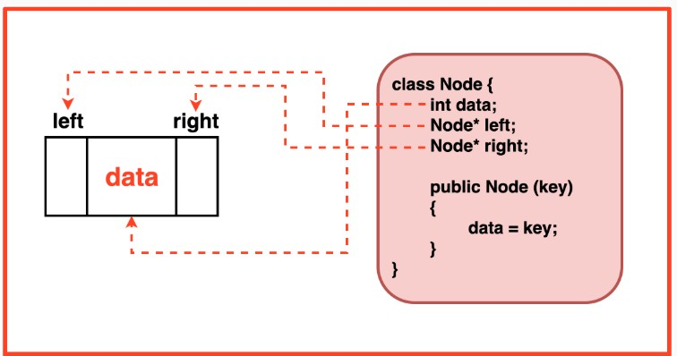
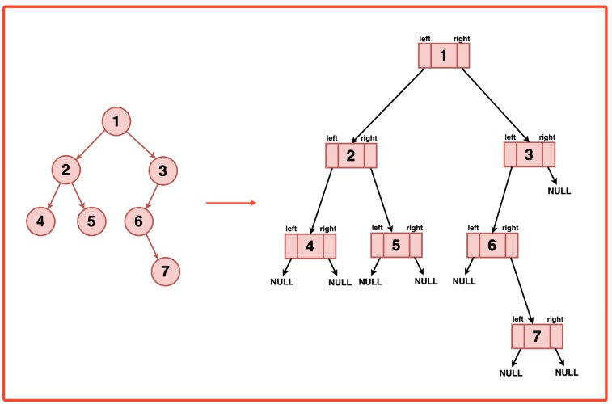
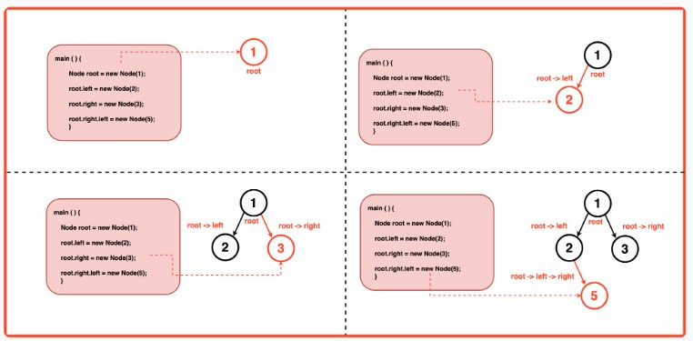
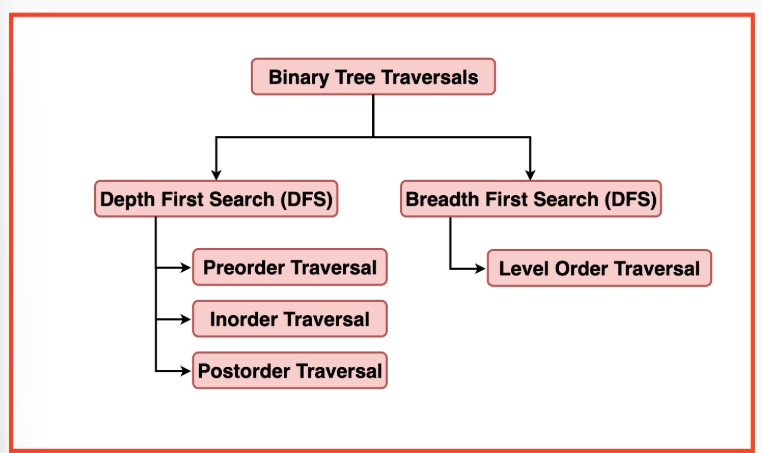
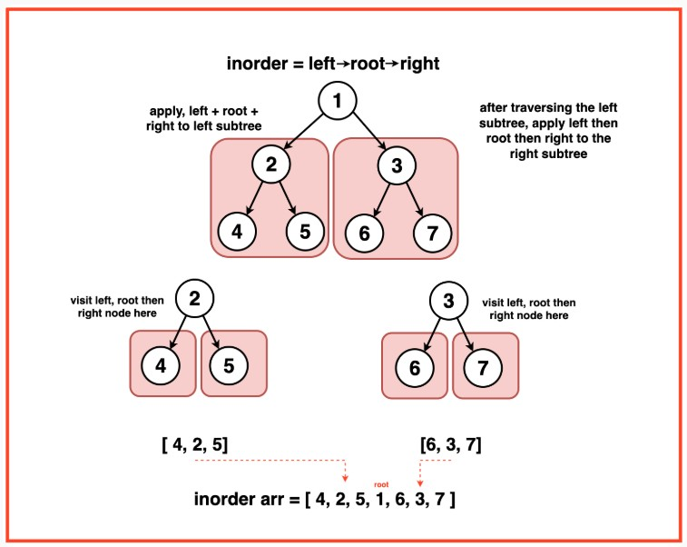
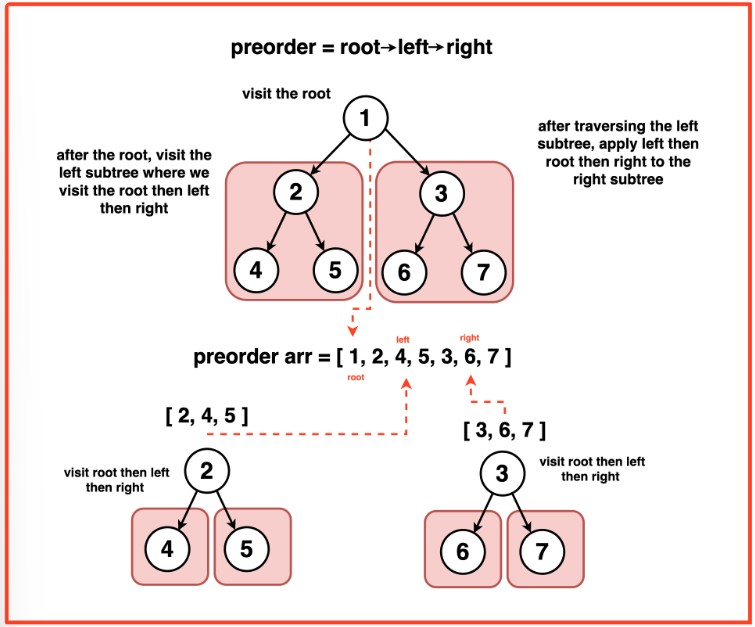
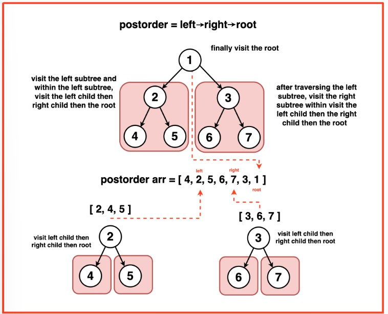
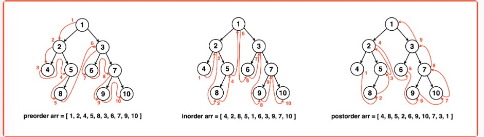
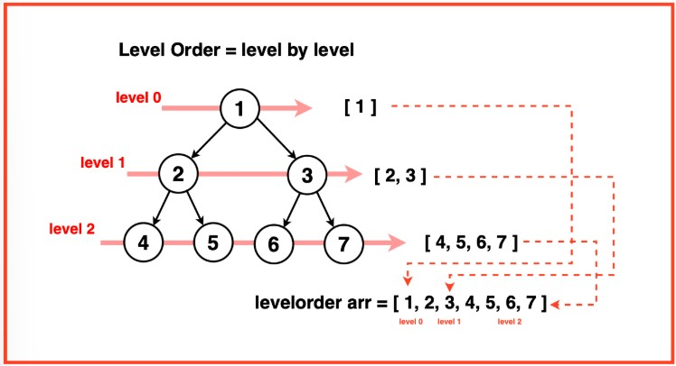

# Binary Tree Representation in Java
In Java, a binary tree is structured using references to other nodes, forming a hierarchical arrangement where each node can refer to at most two other nodes: a left child and a right child.

This reference-based approach establishes connections between nodes, enabling traversal and navigation within the tree structure.

## Node Structure:
In Java, a Binary Tree node is represented using a class that encapsulates the attributes of a node:

- **Data Component**: This holds the value of the node, which could be of any data type (e.g., integer, string, object).
- **Pointers to Children**: Two reference variables ie. ‘left’ and ‘right’ point to the left and right child nodes respectively. These references store the memory addresses of child nodes, allowing traversal and access to further nodes in the tree structure.

In Java, references to objects act similarly to pointers in C++, allowing nodes to refer to other nodes without direct memory manipulation.

## Node Constructor:
In Java, the constructor of the Node class initialises a node with a specific value and sets its left and right references to null to signify that it doesn't have any children initially.

Within the constructor:

- **data = val;** :Sets the data of the node to the provided value (val). This assigns the input integer to the node's data.
- **left = right = NULL;**: Initialises both left and right references as null. This initialization ensures that when a node is created, it does not have any immediate connections to other nodes, indicating the absence of left and right children.

## Node Connection:
Java utilises references between nodes allowing them to refer to other nodes. When creating a new node, memory is allocated for the node object, and the node’s data is stored within it.

References (`left` and `right`) are initialised as `null` to indicate that the node doesn’t currently have any children, The nodes are connected by assigning references of a parent node to its respective left and right child nodes.

# Binary Tree Traversal: Inorder Preorder Postorder
Traversals in hierarchy data structure like Binary Trees can be boardly classified into two different categories: Depth-First Search(DFS) and Breadth-First Search(BFS).Each of them utilises a different strategy to visit the nodes with in the tree.

## Depth-First Search(DFS)
Explores a binary tree by going as deeply as possible along each branch before backtracking.
- It starts from the root and explores as deeply as possible along each branch, visiting nodes until it reaches a leaf node. It then backtracks to the most recent unexplored node and continues until all nodes are visited.
- The order in which we visit a node determines if that traversal would be preorder, inorder and postorder.
- DFS uses recursion or a stack to traverse deeper levels of the tree before visiting nodes at the same level. 

## Breadth-First Search(BFS)
Explores a binary tree level by level, visiting all nodes at a given level before processing to the next level.
- It starts from the root and visits all nodes at level 0, then proceeds to level 1, level 2, and so on. Nodes at a level are visited from left to right.
- BFS uses a queue data structure to maintain nodes at each level, ensuring that nodes at higher levels are visited moving to lower levels.

### Inorder Traversal
it is the type **of Depth First Traversal** where nodes are visited in the order: **Left, Root, Right**.

It's named "inorder" because it traverses the nodes in a sequence where the "Visit" step occurs between the left and right child nodes.

**Procedure of Inorder Traversal**:
- Visit the Left Subtree: Recursively traverse the left subtree until a leaf node or a node with no left child is reached.
- Visit the Current Node: Once at a node, perform the visitation operation (such as printing the node's value or performing an operation with the node's data).
- Traverse the Right Subtree: After visiting the current node, recursively traverse the right subtree, following the same steps as the left subtree.

### Preorder Traversal
It is the type of **Depth First Traversal** where nodes are visited in the order: **Root, Left then Right**.

It's named "preorder" because the "Visit" step occurs before traversing the left and right child nodes.

**Procedure of Preorder Traversal**:

- Visit the Current Node: Begin by visiting the current node, performing the visitation operation (such as printing the node's value or performing an operation with the node's data).
- Traverse the Left Subtree: Recursively traverse the left subtree, following the same steps starting from step 1.
- Traverse the Right Subtree: After fully traversing the left subtree, recursively traverse the right subtree, following the same steps starting from step 1.

### Postorder Traverse
It is the type of **Depth First Traversal** where nodes are visited in the order: **Left, Right then Root**.

It's named "postorder" because the "Visit" step occurs after traversing the left and right child nodes.

**Procedure of Postorder Traversal**:

- Traverse the Left Subtree: Recursively traverse the left subtree, following the same steps starting from step 1.
- Traverse the Right Subtree: Similarly, recursively traverse the right subtree, following the same steps starting from step 1.
- Visit the Current Node: After fully traversing both left and right subtrees, visit the current node, performing the visitation operation (such as printing the node's value or performing an operation with the node's data).

**In Summary:**

## Level Order Traversal
It is the type of **Breadth First Traversal** where nodes are visited level by level, exploring each level completely before moving to the next level.

Level order traversal utilises a queue data structure to maintain the nodes at each level, ensuring that nodes at higher levels are visited before moving to lower levels.

**Procedure of Level Order Traversal**:

- Visit Nodes at Each Level: Starting from the root node, visit all nodes at level 0.
- Move to Next Level: After visiting all nodes at level 0, move to level 1 and visit all nodes at this level from left to right.
- Continue Level-wise: Repeat this process for subsequent levels, visiting nodes at each level from left to right until all levels are visited.